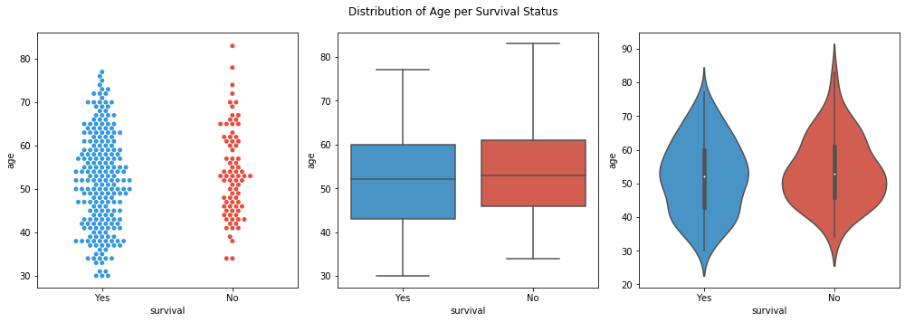

# Inferential Statistics Project


## Project Overview
- The Udacity Inferential Statistics course project is described as:

_For the Inferential Statistics final project, you are required to perform a detailed analysis on one or more of the provided data sets. With your chosen data set(s) you will come up with a hypothesis which you wish to test. You will then design an experiment to test this hypothesis and choose an appropriate test. For example, you may use t-tests, ANOVA tests, or any other hypothesis test covered in the course. Remember to check the conditions of any test that you choose to use. Once you’ve run your test you will also need to provide visualizations to support your test. These can be any of the visualizations we learned in this course or in Descriptive Statistics (i.e. histogram, box-whisker plot, scatterplot, etc.)._

I have picked the Haberman's Survival Data Set for my project...

# About this report   
This report is a presentation of the results of the exploratory data and statistical analyses I conducted. The working code with the same commentary can be found in the accompanying notebook "Inferential Statistics Project.ipynb". The Python libraries `numpy`, `scipy`, `pandas`, `matplotlib`, `pylab` and `seaborn` were used. Some figures will include information about the underlying library or data types used to create them (e.g. `pandas`, `numpy`). 

# Introduction 

## The Haberman's Survival Data Set

http://archive.ics.uci.edu/ml/datasets/Haberman%27s+Survival

### Data Set Information:
(from http://archive.ics.uci.edu/ml/machine-learning-databases/haberman/haberman.names)

The dataset contains cases from a study that was conducted between 1958 and 1970 at the University of Chicago's Billings Hospital on the survival of patients who had undergone surgery for breast cancer.

- Number of Instances: 306
- Number of Attributes: 4 (including the class attribute)
- Attribute Information:
    1. Age of patient at time of operation (numerical)
    2. Patient's year of operation (year - 1900, numerical)
    3. Number of positive axillary nodes detected (numerical)
    4. Survival status (class attribute)
        - 1 = the patient survived 5 years or longer
        - 2 = the patient died within 5 year   
   
- Missing Attribute Values: None  
---
- Sources: Tjen-Sien Lim (limt@stat.wisc.edu), March 4, 1999
---
- Past Usage:
    1. Haberman, S. J. (1976).   
       Generalized Residuals for Log-Linear Models,   
       Proceedings of the 9th International Biometrics Conference, Boston, pp. 104-122.  
    2. Landwehr, J. M., Pregibon, D., and Shoemaker, A. C. (1984),    
       Graphical Models for Assessing Logistic Regression Models (with discussion),   
       Journal of the American Statistical Association 79: 61-83.  
    3. Lo, W.-D. (1993).   
       Logistic Regression Trees, 
       PhD thesis,   
       Department of Statistics, University of Wisconsin, Madison, WI.

### The importance of studying the dataset

The Haberman's Survival Data has been extensively studied, as it provides an example of medical data that can provide insight into patient survival after a medical intervention. It covers outcomes of patients who have had breast surgery over a 12 year period at the University of Chicago's Billings Hospital, and as such it is an sample of the general population of patients undergoing breast surgery.  

It is also a very small dataset (only 306 cases), with only a few features (age, year of operation and number of axillary nodes), which are classified based on the patient's surival or not five years after the surgery. As it contains the actual outcomes it is naturally imbalanced - there are thankfully far more patients who survived, but this imbalance is something that must be accounted for in the data and statistical analysis, and especially beyond that - when predictive models are develpoed to work with it.

In summary, the dataset is a great example of an important area of research and also provides useful challenges in its analysis, and so continues to be studied. I picked it because I am interested in medical research, it was only as I explored it that I understood its value.

----

# Research Question and Hypothesis
- The research question I am asking is whether there is any significant contributor in the data that can be correlated with the survival outcome - that is, what statistical proof exists for any contributing factors to survival?
- The hypothesis will be formulated after an initial data exploration provides insights into the data

## **Exploratory Data Analysis**

### Information about the data as it comes


    <class 'pandas.core.frame.DataFrame'>
    RangeIndex: 306 entries, 0 to 305
    Data columns (total 4 columns):
    age         306 non-null int64
    year        306 non-null int64
    nodes       306 non-null int64
    survival    306 non-null int64
    dtypes: int64(4)
    memory usage: 9.7 KB
    

A few sample rows

<div>
<table border="1" class="dataframe">
  <thead>
    <tr style="text-align: right;">
      <th></th>
      <th>age</th>
      <th>year</th>
      <th>nodes</th>
      <th>survival</th>
    </tr>
  </thead>
  <tbody>
    <tr>
      <th>22</th>
      <td>37</td>
      <td>60</td>
      <td>15</td>
      <td>1</td>
    </tr>
    <tr>
      <th>23</th>
      <td>37</td>
      <td>63</td>
      <td>0</td>
      <td>1</td>
    </tr>
    <tr>
      <th>24</th>
      <td>38</td>
      <td>69</td>
      <td>21</td>
      <td>2</td>
    </tr>
  </tbody>
</table>
</div>


#### The survival column was converted into a categorical value, using "Yes" for the original value 1 and "No" for the 2

    <class 'pandas.core.frame.DataFrame'>
    RangeIndex: 306 entries, 0 to 305
    Data columns (total 4 columns):
    age         306 non-null int64
    year        306 non-null int64
    nodes       306 non-null int64
    survival    306 non-null category
    dtypes: category(1), int64(3)
    memory usage: 7.7 KB
    
The sample rows

<div>
<table border="1" class="dataframe">
  <thead>
    <tr style="text-align: right;">
      <th></th>
      <th>age</th>
      <th>year</th>
      <th>nodes</th>
      <th>survival</th>
    </tr>
  </thead>
  <tbody>
    <tr>
      <th>22</th>
      <td>37</td>
      <td>60</td>
      <td>15</td>
      <td>Yes</td>
    </tr>
    <tr>
      <th>23</th>
      <td>37</td>
      <td>63</td>
      <td>0</td>
      <td>Yes</td>
    </tr>
    <tr>
      <th>24</th>
      <td>38</td>
      <td>69</td>
      <td>21</td>
      <td>No</td>
    </tr>
  </tbody>
</table>
</div>

**The counts of survival vs non-survival categories**

<div>
<table border="1" class="dataframe">
  <thead>
    <tr style="text-align: right;">
      <th>Survival</th>
      <th>Count</th>
      <th>Percentage</th>
    </tr>
  </thead>
  <tbody>
    <tr>
      <th>Yes</th>
      <td>255</td>
      <td>73.5</td>
    </tr>
    <tr>
      <th>No</th>
      <td>81</td>
      <td>26.5</td>
    </tr>
  </tbody>
</table>
</div>

**There are almost 3 times as many subjects surviving their surgery after 5 years compared to those who don't.**

----

### **Examining Survival by Year of operation**

- Most years have 2 to 3 times as many survivors to non-survivors
    - Except 1965 where both groups have almost the same, fairly high, count
    - And 1960 and 1961, where survivors are 6 to 7 times as many
    -- We could group by some of these years, but ...
        - The intuition is that they relate to clinical practices (e.g. oncology team, surgeon), 
        - therefore - they will not reflect any general property of people having breast cancer surgery
        - and so would be useful for assessment of past hospital practices only...   
- Export groupings to Excel for $\tilde{\chi}^2$ (Chi Squared) analysis         

#### An interesting historical insight into the hospital

- https://www.uchicagomedicine.org/about-us/our-history

"_During the 1950s and 1960s, the hospital's facilities doubled in size. Adding two cancer research centers, Wyler Children's Hospital, two research laboratories and other leading-edge facilities, the University of Chicago Hospitals doubled from five divisions to 10, increasing the faculty by 100 percent between 1961 and 1971. Between 1963 and 1974, the size of the staff grew again._"
    
**Survival by Year (Yes/No)**

<div>
<table border="1" class="dataframe">
  <thead>
    <tr style="text-align: right;">
      <th>Year</th>
      <th>Yes</th>
      <th>No</th>
    </tr>
  </thead>
  <tbody>
    <tr>
      <th>58</th>
      <td>24</td>
      <td>12</td>
    </tr>
    <tr>
      <th>59</th>
      <td>18</td>
      <td>9</td>
    </tr>
    <tr>
      <th>60</th>
      <td>24</td>
      <td>4</td>
    </tr>
    <tr>
      <th>61</th>
      <td>23</td>
      <td>3</td>
    </tr>
    <tr>
      <th>62</th>
      <td>16</td>
      <td>7</td>
    </tr>
    <tr>
      <th>63</th>
      <td>22</td>
      <td>8</td>
    </tr>
    <tr>
      <th>64</th>
      <td>23</td>
      <td>8</td>
    </tr>
    <tr>
      <th>65</th>
      <td>15</td>
      <td>13</td>
    </tr>
    <tr>
      <th>66</th>
      <td>22</td>
      <td>6</td>
    </tr>
    <tr>
      <th>67</th>
      <td>21</td>
      <td>4</td>
    </tr>
    <tr>
      <th>68</th>
      <td>10</td>
      <td>3</td>
    </tr>
    <tr>
      <th>69</th>
      <td>7</td>
      <td>4</td>
    </tr>
  </tbody>
</table>
</div>

**Survival grouped by 5 years**

<div>
<table border="1" class="dataframe">
  <thead>
    <tr style="text-align: right;">
      <th>Survival</th>
      <th>&lt; 1960</th>
      <th>1960-65</th>
      <th>&gt; 1965</th>
    </tr>
  </thead>
  <tbody>
    <tr>
      <th>Yes</th>
      <td>42</td>
      <td>123</td>
      <td>60</td>
    </tr>
    <tr>
      <th>No</th>
      <td>21</td>
      <td>43</td>
      <td>17</td>
    </tr>
  </tbody>
</table>
</div>

**Survival divided by the year 1962**

<div>
<table border="1" class="dataframe">
  <thead>
    <tr style="text-align: right;">
      <th>Survival</th>
      <th>&lt; 1962</th>
      <th>&gt;= 1962</th>
    </tr>
  </thead>
  <tbody>
    <tr>
      <th>Yes</th>
      <td>89</td>
      <td>136</td>
    </tr>
    <tr>
      <th>No</th>
      <td>28</td>
      <td>53</td>
    </tr>
  </tbody>
</table>
</div>

**Survival grouped by those operated on in 1960 and 1961, vs all others**
- This looks to be a significant grouping as it sees very few non-surviving

<div>
<table border="1" class="dataframe">
  <thead>
    <tr style="text-align: right;">
      <th>Survival</th>
      <th>1960-61</th>
      <th>Other</th>
    </tr>
  </thead>
  <tbody>
    <tr>
      <th>Yes</th>
      <td>47</td>
      <td>178</td>
    </tr>
    <tr>
      <th>No</th>
      <td>7</td>
      <td>74</td>
    </tr>
  </tbody>
</table>
</div>

----

### **Examining Survival by Age**
- There are quite a few more survivors less than or equal to 40 year old
- Most of the remaining subjects are between 41 and 60
- Look at values in groupings, the 40 and under group may be statistically significant for survival chances

<div>
<table border="1" class="dataframe">
  <thead>
    <tr style="text-align: right;">
      <th>Age / Survival</th>
      <th>30</th>
      <th>31</th>
      <th>33</th>
      <th>34</th>
      <th>35</th>
      <th>36</th>
      <th>37</th>
      <th>38</th>
      <th>39</th>
      <th>40</th>
      <th>41</th>
      <th>42</th>
      <th>43</th>
      <th>44</th>
      <th>45</th>
      <th>46</th>
      <th>47</th>
      <th>48</th>
      <th>49</th>
      <th>50</th>
      <th>51</th>
      <th>52</th>
      <th>53</th>
      <th>54</th>
      <th>55</th>
      <th>56</th>
      <th>57</th>
      <th>58</th>
      <th>59</th>
      <th>60</th>
      <th>61</th>
      <th>62</th>
      <th>63</th>
      <th>64</th>
      <th>65</th>
      <th>66</th>
      <th>67</th>
      <th>68</th>
      <th>69</th>
      <th>70</th>
      <th>71</th>
      <th>72</th>
      <th>73</th>
      <th>74</th>
      <th>75</th>
      <th>76</th>
      <th>77</th>
      <th>78</th>
      <th>83</th>
    </tr>
  </thead>
  <tbody>
    <tr>
      <th>Yes</th>
      <td>3</td>
      <td>2</td>
      <td>2</td>
      <td>5</td>
      <td>2</td>
      <td>2</td>
      <td>6</td>
      <td>9</td>
      <td>5</td>
      <td>3</td>
      <td>7</td>
      <td>7</td>
      <td>7</td>
      <td>4</td>
      <td>6</td>
      <td>3</td>
      <td>8</td>
      <td>4</td>
      <td>8</td>
      <td>10</td>
      <td>4</td>
      <td>10</td>
      <td>5</td>
      <td>9</td>
      <td>8</td>
      <td>5</td>
      <td>8</td>
      <td>7</td>
      <td>7</td>
      <td>4</td>
      <td>6</td>
      <td>4</td>
      <td>7</td>
      <td>5</td>
      <td>6</td>
      <td>3</td>
      <td>4</td>
      <td>2</td>
      <td>3</td>
      <td>5</td>
      <td>1</td>
      <td>3</td>
      <td>2</td>
      <td>1</td>
      <td>1</td>
      <td>1</td>
      <td>1</td>
      <td>0</td>
      <td>0</td>
    </tr>
    <tr>
      <th>No</th>
      <td>0</td>
      <td>0</td>
      <td>0</td>
      <td>2</td>
      <td>0</td>
      <td>0</td>
      <td>0</td>
      <td>1</td>
      <td>1</td>
      <td>0</td>
      <td>3</td>
      <td>2</td>
      <td>4</td>
      <td>3</td>
      <td>3</td>
      <td>4</td>
      <td>3</td>
      <td>3</td>
      <td>2</td>
      <td>2</td>
      <td>2</td>
      <td>4</td>
      <td>6</td>
      <td>4</td>
      <td>2</td>
      <td>2</td>
      <td>3</td>
      <td>0</td>
      <td>1</td>
      <td>2</td>
      <td>3</td>
      <td>3</td>
      <td>1</td>
      <td>0</td>
      <td>4</td>
      <td>2</td>
      <td>2</td>
      <td>0</td>
      <td>1</td>
      <td>2</td>
      <td>0</td>
      <td>1</td>
      <td>0</td>
      <td>1</td>
      <td>0</td>
      <td>0</td>
      <td>0</td>
      <td>1</td>
      <td>1</td>
    </tr>
  </tbody>
</table>
</div>


```python
hab_ages = pd.DataFrame(haberman[["age", "survival"]].copy())
hab_ages["age_group"] = np.where(hab_ages['age'] <= 40, '<= 40',\
                        np.where(hab_ages['age'] <= 50, '41 to 50',\
                        np.where(hab_ages['age'] <= 60, '51 to 60',\
                        np.where(hab_ages['age'] <= 70, '61 to 70',\
                                 '> 70'))))
hab_ages["age_group_40"] = np.where(hab_ages['age'] <= 40, '<= 40',\
                                 '> 40')

hab_ages["num"] = 1  
```


```python
hab_ages.groupby('age_group')['survival'].value_counts().unstack().fillna(0).transpose().astype(int)
```

**Survival by Age group**

<div>
<table border="1" class="dataframe">
  <thead>
    <tr style="text-align: right;">
      <th>Survival</th>
      <th>&lt;= 40</th>
      <th>41-50</th>
      <th>51-60</th>
      <th>61-70</th>
      <th>&gt; 70</th>
    </tr>
  </thead>
  <tbody>
    <tr>
      <th>Yes</th>
      <td>39</td>
      <td>64</td>
      <td>67</td>
      <td>45</td>
      <td>10</td>
    </tr>
    <tr>
      <th>No</th>
      <td>4</td>
      <td>29</td>
      <td>26</td>
      <td>18</td>
      <td>4</td>
    </tr>
  </tbody>
</table>
</div>


**Survival grouped by Age <= 40 and all others**

<div>
<table border="1" class="dataframe">
  <thead>
    <tr style="text-align: right;">
      <th>Survival</th>
      <th>&lt;= 40</th>
      <th>&gt; 40</th>
    </tr>
  </thead>
  <tbody>
    <tr>
      <th>Yes</th>
      <td>39</td>
      <td>186</td>
    </tr>
    <tr>
      <th>No</th>
      <td>4</td>
      <td>77</td>
    </tr>
  </tbody>
</table>
</div>

----

### Examining Survival by number of Axillary Nodes
- Note that for survivors most are concentrated in 4 axillary nodes or less
- Also, both groups have a high number where no nodes exist

<div>
<table border="1" class="dataframe">
  <thead>
    <tr style="text-align: right;">
      <th>Survival</th>
      <th>Yes</th>
      <th>No</th>
    </tr>
    <tr>
      <th>Nodes</th>
      <th></th>
      <th></th>
    </tr>
  </thead>
  <tbody>
    <tr>
      <th>0</th>
      <td>117</td>
      <td>19</td>
    </tr>
    <tr>
      <th>1</th>
      <td>33</td>
      <td>8</td>
    </tr>
    <tr>
      <th>2</th>
      <td>15</td>
      <td>5</td>
    </tr>
    <tr>
      <th>3</th>
      <td>13</td>
      <td>7</td>
    </tr>
    <tr>
      <th>4</th>
      <td>10</td>
      <td>3</td>
    </tr>
    <tr>
      <th>5</th>
      <td>2</td>
      <td>4</td>
    </tr>
    <tr>
      <th>6</th>
      <td>4</td>
      <td>3</td>
    </tr>
    <tr>
      <th>7</th>
      <td>5</td>
      <td>2</td>
    </tr>
    <tr>
      <th>8</th>
      <td>5</td>
      <td>2</td>
    </tr>
    <tr>
      <th>9</th>
      <td>2</td>
      <td>4</td>
    </tr>
    <tr>
      <th>10</th>
      <td>2</td>
      <td>1</td>
    </tr>
    <tr>
      <th>11</th>
      <td>1</td>
      <td>3</td>
    </tr>
    <tr>
      <th>12</th>
      <td>1</td>
      <td>1</td>
    </tr>
    <tr>
      <th>13</th>
      <td>1</td>
      <td>4</td>
    </tr>
    <tr>
      <th>14</th>
      <td>3</td>
      <td>1</td>
    </tr>
    <tr>
      <th>15</th>
      <td>1</td>
      <td>2</td>
    </tr>
    <tr>
      <th>16</th>
      <td>1</td>
      <td>0</td>
    </tr>
    <tr>
      <th>17</th>
      <td>0</td>
      <td>1</td>
    </tr>
    <tr>
      <th>18</th>
      <td>1</td>
      <td>0</td>
    </tr>
    <tr>
      <th>19</th>
      <td>1</td>
      <td>2</td>
    </tr>
    <tr>
      <th>20</th>
      <td>1</td>
      <td>1</td>
    </tr>
    <tr>
      <th>21</th>
      <td>0</td>
      <td>1</td>
    </tr>
    <tr>
      <th>22</th>
      <td>2</td>
      <td>1</td>
    </tr>
    <tr>
      <th>23</th>
      <td>0</td>
      <td>3</td>
    </tr>
    <tr>
      <th>24</th>
      <td>0</td>
      <td>1</td>
    </tr>
    <tr>
      <th>25</th>
      <td>1</td>
      <td>0</td>
    </tr>
    <tr>
      <th>28</th>
      <td>1</td>
      <td>0</td>
    </tr>
    <tr>
      <th>30</th>
      <td>1</td>
      <td>0</td>
    </tr>
    <tr>
      <th>35</th>
      <td>0</td>
      <td>1</td>
    </tr>
    <tr>
      <th>46</th>
      <td>1</td>
      <td>0</td>
    </tr>
    <tr>
      <th>52</th>
      <td>0</td>
      <td>1</td>
    </tr>
  </tbody>
</table>
</div>


### **Survivor counts per groups of nodes**
- There are a some with no nodes at all, where there are fairly large numbers on non-survivors
- Therefore examine in particular the following groups
    - Three or less vs all others
    - Four or less vs all others
    - Between 1 and 3 vs all greater than 3
    - Between 1 and 4 vs all greater than 4
- Export groupings to Excel for $\tilde{\chi}^2$ (Chi Squared) analysis     
- See Appendix entry "Examining Nodes groupings" for examination of all nodes groupings...    

**Grouped by 3**

<div>
<table border="1" class="dataframe">
  <thead>
    <tr style="text-align: right;">
      <th>Survival</th>
      <th>Yes</th>
      <th>No</th>
    </tr>
  </thead>
  <tbody>
    <tr>
      <th>&gt; 3</th>
      <td>42</td>
      <td>47</td>
    </tr>
    <tr>
      <th>&lt;= 3</th>
      <td>39</td>
      <td>178</td>
    </tr>
  </tbody>
</table>
</div>

**Grouped by 3 percentages**

<div>
<table border="1" class="dataframe">
  <thead>
    <tr style="text-align: right;">
      <th>Survival</th>
      <th>Yes %</th>
      <th>No %</th>
    </tr>
  </thead>
  <tbody>
    <tr>
      <th>&gt; 3</th>
      <td>52</td>
      <td>21</td>
    </tr>
    <tr>
      <th>&lt;= 3</th>
      <td>48</td>
      <td>79</td>
    </tr>
  </tbody>
</table>
</div>


----
**Grouped by 4**

<div>
<table border="1" class="dataframe">
  <thead>
    <tr style="text-align: right;">
      <th>Survival</th>
      <th>Yes</th>
      <th>No</th>
    </tr>
  </thead>
  <tbody>
    <tr>
      <th>&gt; 4</th>
      <td>39</td>
      <td>37</td>
    </tr>
    <tr>
      <th>&lt;= 4</th>
      <td>42</td>
      <td>188</td>
    </tr>
  </tbody>
</table>
</div>
    
**Grouped by 4 percentages**

<div>
<table border="1" class="dataframe">
  <thead>
    <tr style="text-align: right;">
      <th>Survival</th>
      <th>Yes %</th>
      <th>No %</th>
    </tr>
  </thead>
  <tbody>
    <tr>
      <th>&gt; 4</th>
      <td>48</td>
      <td>16</td>
    </tr>
    <tr>
      <th>&lt;= 4</th>
      <td>52</td>
      <td>84</td>
    </tr>
  </tbody>
</table>
</div>


----

### Survivor counts with zero nodes as a separate group
If the subjects having no nodes at all are included then there are similar numbers of non-survivors in each group.  
However, the numbers of survivors are concentrated in those with less than 4 or 3 nodes.  
Look at the data with the zero nodes subjects as a separate group, and when excluded...

**Grouped by 3 with zero nodes as a separate group**

<div>
<table border="1" class="dataframe">
  <thead>
    <tr style="text-align: right;">
      <th>Survival</th>
      <th>Yes</th>
      <th>No</th>
    </tr>
  </thead>
  <tbody>
    <tr>
      <th>0</th>
      <td>117</td>
      <td>19</td>
    </tr>
    <tr>
      <th>1 to 3</th>
      <td>61</td>
      <td>20</td>
    </tr>
    <tr>
      <th>&gt; 3</th>
      <td>47</td>
      <td>42</td>
    </tr>
  </tbody>
</table>
</div>

<br/>

<div>
<table border="1" class="dataframe">
  <thead>
    <tr style="text-align: right;">
      <th>Survival</th>
      <th>Yes %</th>
      <th>No %</th>
    </tr>
  </thead>
  <tbody>
    <tr>
      <th>0</th>
      <td>52</td>
      <td>23</td>
    </tr>
    <tr>
      <th>1 to 3</th>
      <td>27</td>
      <td>25</td>
    </tr>
    <tr>
      <th>&gt; 3</th>
      <td>21</td>
      <td>52</td>
    </tr>
  </tbody>
</table>
</div>


**Grouped by 3 with zero nodes group excluded**

<div>
<table border="1" class="dataframe">
  <thead>
    <tr style="text-align: right;">
      <th>Survival</th>
      <th>Yes</th>
      <th>No</th>
    </tr>
  </thead>
  <tbody>
    <tr>
      <th>1 to 3</th>
      <td>61</td>
      <td>20</td>
    </tr>
    <tr>
      <th>&gt; 3</th>
      <td>47</td>
      <td>42</td>
    </tr>
  </tbody>
</table>
</div>

<br/>

<div>
<table border="1" class="dataframe">
  <thead>
    <tr style="text-align: right;">
      <th>Survival</th>
      <th>Yes %</th>
      <th>No %</th>
    </tr>
  </thead>
  <tbody>
    <tr>
      <th>1 to 3</th>
      <td>56</td>
      <td>32</td>
    </tr>
    <tr>
      <th>&gt; 3</th>
      <td>44</td>
      <td>68</td>
    </tr>
  </tbody>
</table>
</div>


----

**Grouped by 4 with zero nodes as a separate group**

<div>
<table border="1" class="dataframe">
  <thead>
    <tr style="text-align: right;">
      <th>Survival</th>
      <th>Yes</th>
      <th>No</th>
    </tr>
  </thead>
  <tbody>
    <tr>
      <th>0</th>
      <td>117</td>
      <td>19</td>
    </tr>
    <tr>
      <th>1 to 4</th>
      <td>71</td>
      <td>23</td>
    </tr>
    <tr>
      <th>&gt; 4</th>
      <td>37</td>
      <td>39</td>
    </tr>
  </tbody>
</table>
</div>

<br/>

<div>
<table border="1" class="dataframe">
  <thead>
    <tr style="text-align: right;">
      <th>Survival</th>
      <th>Yes %</th>
      <th>No %</th>
    </tr>
  </thead>
  <tbody>
    <tr>
      <th>0</th>
      <td>52</td>
      <td>23</td>
    </tr>
    <tr>
      <th>1 to 4</th>
      <td>32</td>
      <td>28</td>
    </tr>
    <tr>
      <th>&gt; 4</th>
      <td>16</td>
      <td>48</td>
    </tr>
  </tbody>
</table>
</div>

**Grouped by 4 with zero nodes group excluded**

<div>
<table border="1" class="dataframe">
  <thead>
    <tr style="text-align: right;">
      <th>Survival</th>
      <th>Yes</th>
      <th>No</th>
    </tr>
  </thead>
  <tbody>
    <tr>
      <th>1 to 4</th>
      <td>71</td>
      <td>23</td>
    </tr>
    <tr>
      <th>&gt; 4</th>
      <td>37</td>
      <td>39</td>
    </tr>
  </tbody>
</table>
</div>

<br/>

<div>
<table border="1" class="dataframe">
  <thead>
    <tr style="text-align: right;">
      <th>Survival</th>
      <th>Yes %</th>
      <th>No %</th>
    </tr>
  </thead>
  <tbody>
    <tr>
      <th>1 to 4</th>
      <td>66</td>
      <td>37</td>
    </tr>
    <tr>
      <th>&gt; 4</th>
      <td>34</td>
      <td>63</td>
    </tr>
  </tbody>
</table>
</div>


### Survivor counts per groups of nodes - summary
If those having no nodes are excluded, and the remaining are grouped around the threshold of having either 3 or 4 nodes or less, then there is a clear pattern of survival vs non-survival. The pattern is clearest at the 4 node threshold - those having between 1 and 4 nodes vs having greater than 4 nodes - the within-group percentages are almost exactly reversed. The zero nodes group may be best be treated separately, but we will be not be excluding them from the statistical analysis.

----

## Statistical summaries of Survival

**Overall statistical summary**

    Haberman statistics
                age      year     nodes
    count  306.0000  306.0000  306.0000
    mean    52.4575   62.8529    4.0261
    std     10.8035    3.2494    7.1897
    min     30.0000   58.0000    0.0000
    25%     44.0000   60.0000    0.0000
    50%     52.0000   63.0000    1.0000
    75%     60.7500   65.7500    4.0000
    max     83.0000   69.0000   52.0000
    

**Statistics with zero nodes removed**

    Haberman statistics with zero nodes removed
                age      year     nodes
    count  170.0000  170.0000  170.0000
    mean    51.4588   62.6529    7.2471
    std     10.3599    3.2983    8.3551
    min     30.0000   58.0000    1.0000
    25%     44.0000   60.0000    2.0000
    50%     52.0000   62.5000    4.0000
    75%     57.7500   65.0000    9.7500
    max     83.0000   69.0000   52.0000
    

**Survival group statistics**

    Survival statistics
                age      year     nodes
    count  225.0000  225.0000  225.0000
    mean    52.0178   62.8622    2.7911
    std     11.0122    3.2229    5.8703
    min     30.0000   58.0000    0.0000
    25%     43.0000   60.0000    0.0000
    50%     52.0000   63.0000    0.0000
    75%     60.0000   66.0000    3.0000
    max     77.0000   69.0000   46.0000
    

**Survival group statistics with zero nodes excluded**

    Survival statistics with zero nodes excluded
                age      year     nodes
    count  108.0000  108.0000  108.0000
    mean    49.7870   62.5000    5.8148
    std     10.4139    3.2339    7.3753
    min     30.0000   58.0000    1.0000
    25%     42.0000   60.0000    1.0000
    50%     50.0000   62.0000    3.0000
    75%     56.0000   65.0000    7.0000
    max     77.0000   69.0000   46.0000
    

**Non-Survival group statistics**

    Non-Survival statistics
               age     year    nodes
    count  81.0000  81.0000  81.0000
    mean   53.6790  62.8272   7.4568
    std    10.1671   3.3421   9.1857
    min    34.0000  58.0000   0.0000
    25%    46.0000  59.0000   1.0000
    50%    53.0000  63.0000   4.0000
    75%    61.0000  65.0000  11.0000
    max    83.0000  69.0000  52.0000
    

**Non-Survival group statistics with zero nodes excluded**

    Non-survival statistics with zero nodes excluded
               age     year    nodes
    count  62.0000  62.0000  62.0000
    mean   54.3710  62.9194   9.7419
    std     9.6721   3.4179   9.3825
    min    34.0000  58.0000   1.0000
    25%    47.2500  60.0000   3.0000
    50%    53.0000  63.0000   7.0000
    75%    60.7500  65.0000  13.0000
    max    83.0000  69.0000  52.0000
    

### Survivor statistical summary observation
There is very little difference in the distributions of age and year of operation per survival status, but the distribution of the number of auxiliary nodes is quite different, with nodes having a much higher mean and standard deviation in the non-surviving group. This is explored in greater detail in the following charts.

----

## Histograms 

**Distributions of values in the Haberman dataset**


**Distributions of values in the surviving subjects only**


**Distributions of values in the non-surviving subjects only**


----

## Distributions


**Distributions of values per Survival status**


The pairplots above illustrate relationships between the Survival outcome and the Age, Year, and Nodes values. The surviving subjects are rendered in blue, the non-surviving subjects are in red.

The distribution curves show no significant difference when plotted over Age, although the range of ages in the not-survived group is slightly smaller due to fewer people under the age of 35. 

For the Year there is a dip in the not survived count accompanied by an increase in the survived count around the years 1960 and 1961, and the reverse of this effect around 1967. As this data all comes from the University of Chicago's Billings Hospital its possible that a temporary increase of surviving patients could be due to practises in the hospital for this period - even something like a visiting surgeon or the members of the Oncology team could have contributed to a better outcome.

The Nodes count has a very clear difference in distributions between survived and not survived. The remaining analysis focuses on these differences...

----

## Focus on Survivors vs Nodes distributions

### **Survivors vs Nodes distribution numbers**


**Survival group nodes distribution**

    count    225.000000
    mean       2.791111
    std        5.870318
    min        0.000000
    25%        0.000000
    50%        0.000000
    75%        3.000000
    max       46.000000
    Name: nodes, dtype: float64

**Non-Survival group nodes distribution**

    count    81.000000
    mean      7.456790
    std       9.185654
    min       0.000000
    25%       1.000000
    50%       4.000000
    75%      11.000000
    max      52.000000
    Name: nodes, dtype: float64


The distribution figures above highlight the differences in distribution of between nodes counts in the surviving and non-surviving groups. The mean node count for the surviving group is less than 3, with the 75% percentile of the group having 3 nodes, whereas the not-surviving group have a mean node count of 7.5, and the 75% percentile corresponds to 11 nodes, with 50% corresponding to 4 nodes. 

There are quite extreme counts in both groups, but more of them are outliers in the survived group, whereas they mostly fit within the standard distribution of the not-survived group - as can be seen in the further distribution plots below. The plots show that the majority of the surviving group have 3 nodes or less, with those that have more than around 7 being considered as outliers. By contrast, the non-surviving group have a far wider distribution and they don't have any outliers until after around 25 nodes.

### **Survivors vs Nodes box and violin plots**


### **Survivors vs Nodes Kernel Density Estimate plots**


**Kernel Density Estimates per Survival status**


**Kernel Density Estimates per Survival status, with outliers removed**
- 40 rows removed so we can see core distributon differences closely


## Survivors vs Nodes insights summary

<div>

</div>

The Nodes count has a very clear difference in distributions between survived and not survived. The majority (79%) of the nodes counts in the survived group are less than 4 (84% <= 4), whereas the not-survived group have greater nodes counts in the higher range of the population. 

The relationship between nodes counts and survival is explored in terms of node count distributions and kernel density esitmates (KDE) charts above. The KDE estimates the probability density function of a continuous random variable, here it shows that it is roughly twice as probable for non-surviving subjects to have 3 or more nodes compared to the surviving group - that is, from around 3 on the nodes x-axis the line for non-survival has roughly twice the amplitude of the surviving group on the y-axis.

The final chart removes the outliers so that the core relationships can be viewed more clearly.

## CDF (Cumulative Distributed Function) - another insight

The cumulative distribution function (cdf) is the probability that the variable having a value less than or equal to x. 

   
**CDF plots of proportions of counts per features**


The CDF plots above are for all subjects, the plot for nodes shows a quite different probability pattern.

**CDF plots of Nodes per Survival Status**


Focusing again on the relationship between the number of nodes and survival, this CDF has plotted the surviving and non-surviving groups separately. 

The top line that approaches the y-axis just above 0.8 illustrates the surviving group - that is, the 84% of of the group that have 4 nodes or less (if you drop a line to the x-axis at that point it intersects at around 3 or 4). The bottom half of the CDF for that group heads down towards zero by the time we reach 14 or 15 on the x axis - meaning that the majority of the data exists with less than around 14 nodes. 

The line that approaches the y-axis just under 0.6 illustrates the non-surviving group - that is, the 52% of them having 4 nodes or less, the rest having a higher proportion of nodes compared to the surviving group. The bottom half of this line does not apporach zero until around 32 nodes. 

The differences between the distributions are easily discernable, in contrast to the equivalent comparisons for Age and year, produced below...

<div>

</div>

The CDF plot for Age shows that the Survived group starts before the Non-Surviving group, and that there is a divergence between them around the mid to late 40s, but apart from that they are very similar.  

The CDF plot for Year show divergence between 1960 and 1961, and again around 1966.

----

## Remaining values in more detail

The following 2 plots illustrate the closer relationships of the Age and Year values per suvival groupings, and that they seem unlikely to contribute significantly to the survival outcome.

The Age box illustrates that the first percentile of the surviving group is lower than the non-surviving group, and the third percentile of the non-surviving group is a little higher, but there is little difference between the two.   

The violin plot shows more clearly that the non-surviving group is more densly distributed around the age of 50 compared to the surviving group. 


**Distribution of Age per Survival Status**




The Year scatter and violin plots illustrate the decrease in non-survival distributions in the early 1960s, where survival was better for a couple of years. It could be worth exploring why survival improved momentarily in these years. 
  
The decrease in distributions later in the 1960s is more gradual in its effect and could a response to better practises, but the surviving group also decreases, because fewer operations were performed towards the end of the study.

**Distribution of Year per Survival Status**


# Statistical Analysis

## The hypotheses:

1. Having **axillary nodes** is a statistically significant indicator of decreased survival chances    
 - It's important to know if any axillary nodes at all are statistically signficant
 - It's useful to understand the difference in possible outcomes around a certain number of nodes
 
    The null hypothesis --> That the number of nodes has no effect on survival outcome.  
    The alternative hypothesis --> that any number of nodes has a negative effect on survival.

    We will try and establish if having 4 nodes is a significant number compared to others

2. **Age grouping by less than or equal to 40** vs. over 40 has a statistically significant effect.
 - If proven it can indicate that being younger than around 40 years of age is an important factor for likely survival  
  
    The null hypothesis --> That an age less than or equal to 40 has no effect on survival outcome.  
    The alternative hypothesis --> that an age less than or equal to 40 has a positive effect on survival. 

3. Having an **operation in the years 1960 and 1961** has a statistically significant effect.
 - This could be of interest if we need to consider changes in the treatments around this potentially significant period  
  
    The null hypothesis --> That an operation in the years 1960 or 1961 has no effect on survival outcome.  
    The alternative hypothesis --> that an operation in the years 1960 or 1961 has a positive effect on survival. 

# Experimental Design

The exploratory data analysis (EDA) shows that the distribution of axillary nodes is quite different between the survived and not suvived groups. Even without a test it's obvious from the differing means and standard deviations that there is an effect. Because of the inequality of the data a Two-Sample t-Test Assuming Unequal Variances (Welch's t-Test) will be conducted. It is expected to show a statistically significant difference and prove the proposed alternative hypothesis that the presence of nodes is a significant indicator of a poor likelihood of survival. 

In order to clarify what number of nodes are most indicative of a turning point in survival chances we will conduct a series of Chi-Squared tests on a progressing number of nodes, it is hoped that around 3 or 4 nodes will emerge as the most significant number, since that seems evident from the data analysis.

For the other variables we will conduct standard Two-Sample t-Tests Assuming Equal Variances, as the means and standard deviations between the survived and not survived groups are close for these two groups. It is expected that the test will prove the null hypothesis to be correct.

However, we will also conduct a range of Chi-Squared tests for various groupings of these variables, as the EDA has indicated a group of aged 40 and less have a greater survival chance, as does a group who had their operations in the years 1960 and 1961. It is hoped that these groupings will prove to be statistically significant. The latter group of year of operation, if significant, might point us to review hospital practices during that period.

# Results

## Descriptive Statistics

<div>

</div>
<div>

</div>
<div>

</div>


----

## **Axillary Nodes vs Survival**
### Inferential Statistics
    
**Hypotheis**: Having axillary nodes is a statistically significant indicator of decreased survival chances    
- The null hypothesis --> That the number of nodes has no effect on survival outcome.
- The alternative hypothesis --> that any number of nodes has a negative effect on survival

**Test 1: Welch's t-Test** (Two-Sample t-Test Assuming Unequal Variances)
- Chosen because we are treating the Survived and Non-Survived groups as separate groups, and for node counts their variances differ significantly

**Test 2: Chi-Squared tests against the groupings of node counts**
- Chosen to test the significance of grouping to specific nodes counts
- It's hoped that it will show a statistical effect most significantly at 4 or 3 nodes

**Using alpha level of 0.05 for the tests...**

### **Test 1: Nodes - Welch t test:**  
<div>

</div>


P value and statistical significance:			
The two-tailed P value is less than 0.0001			
By conventional criteria, this difference is considered to be **extremely statistically significant**.
			
**Confidence interval:**   
  The mean of Survived minus Not Survived equals -4.67			
  95% confidence interval of this difference: From -6.83 to -2.50			
			
**Intermediate values used in calculations:**   
  t = 4.2683			
  df = 104			
  standard error of difference = 1.093			
			
**Explanation:**
The unequal variance t test is more useful when you think about it as a way to create a confidence interval. Your prime goal is not to ask whether two populations differ, but to quantify how far apart the two means are. The unequal variance t test reports a confidence interval for the difference between two means that is usable even if the standard deviations differ			
			
**Data Summary:**
```
Group     Survived    Not Survived	
Mean	  2.79        7.46	
SD        5.87        9.19	
SEM       0.39        1.02	
N         225         81	
```

### On the basis of these tests we can say that the alternative hypothesis is proven

### **Test 2: Chi-Squared tests for significance of number of nodes**
- Chi-Squared tests were conducted for paired groupings of nodes - that is from less than or equal to a number vs greater than the number
- The ranges tested were from 1 to 7
- The highest Chi-Squared value came with **4 nodes**
- We evaluated the Chi-Squared value with Cramer's V test - the effects were medium to small, based on the following definitions
<div>

</div>
    

#### Chi-Squared tests for significance of number of nodes  
<div>

</div>
    

#### Chi-Squared scores per Nodes count    
<div>    

</div>

### On the basis of the Chi-Squared tests we can confirm greatest significance in having <= 4 nodes

----

## **Age vs Survival**
### Inferential Statistics
    
**Hypotheis**: Age grouping by less than or equal to 40 vs. over 40 has a statistically significant effect.
  
The null hypothesis --> That an age less than or equal to 40 has no effect on survival outcome.  
The alternative hypothesis --> that an age less than or equal to 40 has a positive effect on survival. 
    
**Test 1: Two-Sample t-Test Assuming Equal Variances**
- Chosen because we are treating the Survived and Non-Survived groups as separate groups, and for Age their variances are similar
- It's expected that the t-Test will prove the null hypothesis when applied to the raw data

**Test 2: Chi-Squared test against age groups in 10 year increments**
- Chosen to test the significance of a standard grouping
- Like the t-Test, it's not expected to demonstrate statistical significance

**Test 3: Chi-Squared test against the 40 and under age group vs those over 40**
- Chosen to test the significance of the grouping
- It's hoped that it will show a statistical effect

**Using alpha level of 0.05 for the tests...**

### **Test 1: Ages - Two-Sample t-Test Assuming Equal Variances**
<div>

</div>


**With a t Statistic of `1.187` we do not exceed either of the one or two-tailed t Critical requirements for significance** 
- The null hypothesis is proven

### **Test 2: Chi-Squared test of Age groups**
- **Degrees of freedom = 4**
   
<div>    

</div>
   

**The Chi-squared value does not exceed Chi-critical**
- The null hypothesis is proven

### **Test 3: Chi-squared test of 40 and under age group vs those older**
   
<div>

</div>
   

### From the Chi-Squared tests we deduce significance in being <= 40 years of age
- This cannot be considered in isolation from the axillary nodes effect

  
----

## **Year vs Survival**
### Inferential Statistics
    
Having an **operation in the years 1960 and 1961** has a statistically significant effect.
 - This could be of interest if we need to consider changes in the treatments around this potentially significant period  
  
The null hypothesis --> That an operation in the years 1960 or 1961 has no effect on survival outcome.  
The alternative hypothesis --> that an operation in the years 1960 or 1961 has a positive effect on survival. 

**Test 1: Two-Sample t-Test Assuming Equal Variances**
- Chosen because we are treating the Survived and Non-Survived groups as separate groups, and for Year their variances are similar, apart from the years 1960 and 1961, and 1966.
- It's expected that the t-Test will prove the null hypothesis when applied to the raw data

**Test 2: Chi-Squared tests against years in various groups**
- Chosen to test the significance of a standard grouping
- Like the t-Test, it's not expected to demonstrate statistical significance

**Test 3: Chi-Squared test against the years 1960 and 1960 vs all others**
- Chosen to test the significance of these two years
- It's hoped that it will show a statistical effect

**Using alpha level of 0.05 for the tests...**

### **Test 1: Years - Two-Sample t-Test Assuming Equal Variances**
<div> 

</div>
   
**With a t Statistic of `-0.083` we do not exceed either of the one or two-tailed t Critical requirements for significance** 
- The null hypothesis is proven

### **Test 2: Chi-Squared tests against years in various groups**
<div> 

</div>
- Neither of these show significance
    
### **Test 3: Chi-squared test of years 1960 and 1961 vs all other years**
<div> 

</div>
   
### From the Chi-Squared tests we deduce significance in operations in 1960 to 1961
- This could be due to hospital staff and/or practises in those years 

# Conclusion

- Conducting an exploratory data analysis provided many insights into the data, which enabled informed hypothesis proposals
- We assessed the variables of axillary nodes, age, and year of operation into the given categories of Survival or Non-Survival after 5 years

- The hypotheses for the effect of axillary nodes on survival proposed (1) that having any number of axillary nodes was signficant for the outcome of non-survival, and (2) that 4 nodes was a critical number for deciding on the impact of an increasing number of nodes. Both the t-Test and Chi-Squared tests we conducted supported these alternative hypotheses.

- The hypotheses for age were that (1) an overall assessment age and (2) for age groups would not be significant, but (3) that a grouping into those 40 years and younger would show a signficant trend for survival in that group. A t-Test supported the first proposal for the null hypothesis, Chi-Squared tests supported both the null hypothesis for insignificance of general age groupings and the alternative hypothesis for the significance of the 40 years and younger grouping.

- The hypotheses for year were that (1) overall year has no significance, and (2) nor do groupings of year, but that (3) the years 1960 and 1961 as a group compared to all other years would be significant. The t-Test and Chi-Squared tests we conducted confirmed the null hypotheses for the first two proposals and the alternative hypothesis for the third proposal

In conclusion, this analysis showed that even a small sample can hold some very interesting and statistically significant data, and a thorough exploratory data analysis is conducted can assist with understanding what points and groupings in the data might be significant.

# Appendix

## Haberman.names
1. Title: Haberman's Survival Data

2. Sources:
   (a) Donor:   Tjen-Sien Lim (limt@stat.wisc.edu)
   (b) Date:    March 4, 1999

3. Past Usage:
   1. Haberman, S. J. (1976). Generalized Residuals for Log-Linear
      Models, Proceedings of the 9th International Biometrics
      Conference, Boston, pp. 104-122.
   2. Landwehr, J. M., Pregibon, D., and Shoemaker, A. C. (1984),
      Graphical Models for Assessing Logistic Regression Models (with
      discussion), Journal of the American Statistical Association 79:
      61-83.
   3. Lo, W.-D. (1993). Logistic Regression Trees, PhD thesis,
      Department of Statistics, University of Wisconsin, Madison, WI.

4. Relevant Information:
   The dataset contains cases from a study that was conducted between
   1958 and 1970 at the University of Chicago's Billings Hospital on
   the survival of patients who had undergone surgery for breast
   cancer.

5. Number of Instances: 306

6. Number of Attributes: 4 (including the class attribute)

7. Attribute Information:
   1. Age of patient at time of operation (numerical)
   2. Patient's year of operation (year - 1900, numerical)
   3. Number of positive axillary nodes detected (numerical)
   4. Survival status (class attribute)
         1 = the patient survived 5 years or longer
         2 = the patient died within 5 year

8. Missing Attribute Values: None
----

## Links for project overview, tips and rubric:
  
https://docs.google.com/document/d/1C8l2VxDJEQLJFt97G6hkwbCaR05mW_0BOYz865sILWE/pub   
https://docs.google.com/document/d/1JpkpmmZGAhyVZVqgQCEbrznOPXt64mKy8vj3nC_TSFk/pub   
https://docs.google.com/document/d/1GyabZyEIFxwt-5_udINmVJG440Cg8Sz0OICf67CUVsc/pub    

----

## Resources for EDA
- Some of the exploratory data analysis concepts were informed by reading through these sites   
   
https://towardsdatascience.com/will-habermans-survival-data-set-make-you-diagnose-cancer-8f40b3449673   
https://towardsdatascience.com/exploratory-data-analysis-habermans-cancer-survival-dataset-c511255d62cb  
https://www.kaggle.com/kernels/scriptcontent/2743116/download   

----

## Combined KDE plot of Node per Survival 


## Plots with zero nodes excluded

**Distributions of values per Survival status, zero nodes excluded**


**Distributions of Node counts per Survival status, with zero nodes excluded**


**Distributions of nodes and Kernel Density Estimates per Survival status, zero nodes excluded**


**Distribution of nodes and Kernel Density Estimates per Survival Status, zero nodes excluded**


**Kernel Density Estimates per Survival status, zero nodes excluded**


**Survival group nodes statistics with zero nodes excluded**


    count    108.000000
    mean       5.814815
    std        7.375316
    min        1.000000
    25%        1.000000
    50%        3.000000
    75%        7.000000
    max       46.000000
    Name: nodes, dtype: float64


**Non-Survival group nodes statistics with zero nodes excluded**


    count    62.000000
    mean      9.741935
    std       9.382466
    min       1.000000
    25%       3.000000
    50%       7.000000
    75%      13.000000
    max      52.000000
    Name: nodes, dtype: float64


